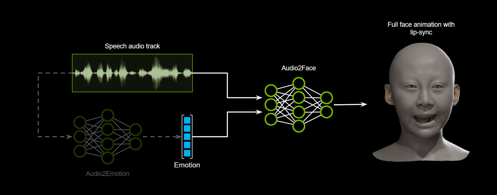

# Audio2Face-3D Microservice

NVIDIA Audio2Face-3D NIM (A2F-3D NIM) is delivering generative AI avatar animation solutions based on audio and emotion inputs.

The Audio2Face-3D Microservice converts speech into facial animation in the form of
[ARKit Blendshapes](https://developer.apple.com/documentation/arkit). The facial animation includes emotional
expression. Where emotions can be detected, the facial animation system captures key poses and shapes to replicate
character facial performance by automatically detecting emotions in the input audio. Additionally emotions can be
directly specified as part of the input to the microservice. A rendering engine can consume Blendshape topology to
display a 3D avatar's performance.

This Git repository stores resources presented in
[Audio2Face-3D Microservice documentation](https://docs.nvidia.com/ace/latest/modules/a2f-docs/text/getting_started/overview.html).
Audio2Face-3D NIM can be obtained through the [NGC Catalog](https://catalog.ngc.nvidia.com/):

| Resource | Tags | Type |
|----------|------|------|
| `nim/nvidia/audio2face-3d` | `latest`, `2`, `2.0`, `2.0.0` | NIM |
| `nim/nvidia/audio2face-3d` | `2.0`, `2.0.0` | Helm Chart |
| `nim/nvidia/audio2face-3d-nv-one-click-script` | `latest`, `2`, `2.0`, `2.0.0` | Resource |

## Example Workflows

For example workflows, please see the [NVIDIA ACE samples, workflows, and resources](https://github.com/NVIDIA/ACE?tab=readme-ov-file#digital-human-workflows) Git repository.

## Documentation

Full Audio2Face-3D NIM [developer documentation](https://docs.nvidia.com/ace/latest/modules/a2f-docs/text/getting_started/overview.html).

## Repository structure

Here is a quick overview of the available Audio2Face-3D resources in this Git repository:

* `configs/` folder:
  * Contains example static deployment, advanced and stylization configurations.
* `early_access/` folder:
  * Contains examples and sample applications for our early access releases.
* `example_audio/` folder:
  * Contains example audio files.
* `migration/` folder:
  * Contains scripts to help you migrate from previous versions of A2F-3D to latest.
* `proto/` folder:
  * Contains gRPC proto definitions for the microservices and instructions for
    installing them.
* `quick-start/` folder:
  * Contains docker compose files deploying Audio2Face-3D (A2F-3D) and collecting telemetry data.
* `scripts/` folder:
  * Contains example applications using Audio2Face-3D (A2F-3D) Microservice and instructions for
    running the scripts.

## License

Github - [Apache 2](https://www.apache.org/licenses/LICENSE-2.0.txt)

ACE NIMs and NGC Microservices - [NVIDIA Software License Agreement](https://www.nvidia.com/en-us/agreements/enterprise-software/nvidia-software-license-agreement/) and [Product-Specific Terms for NVIDIA AI Products](https://www.nvidia.com/en-us/agreements/enterprise-software/product-specific-terms-for-ai-products/). Use of the Audio2Face models is governed by the [NVIDIA Open Model License](https://www.nvidia.com/en-us/agreements/enterprise-software/nvidia-open-model-license/). Use of the Audio2Emotion model is governed by the [License Agreement for NVIDIA Audio2Emotion Model for Use with Audio2Face Project](https://huggingface.co/nvidia/Audio2Emotion-v3.0/blob/main/LICENSE).

Note: This project will download and install additional third-party open source software projects. Review the license terms of these open source projects before use.
